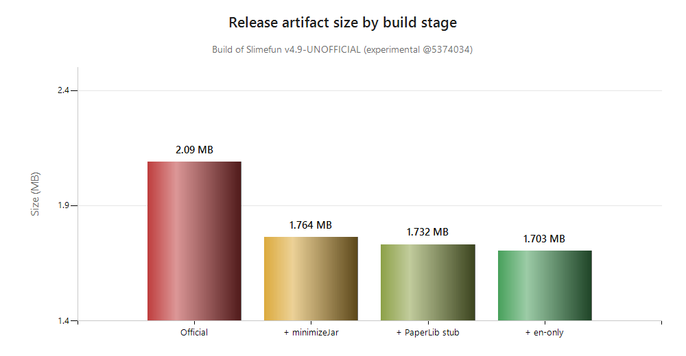
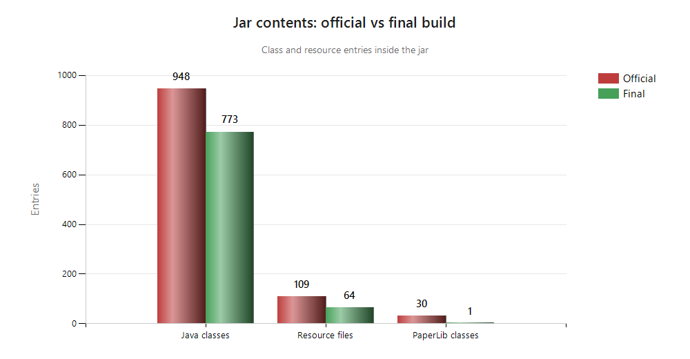
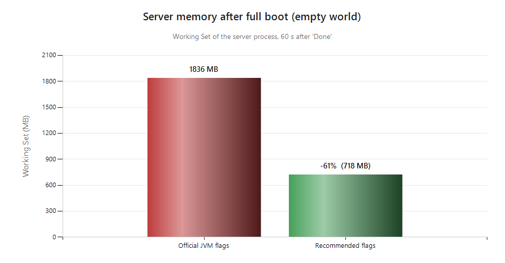

# Slimefun-slim

> **An unofficial, data-driven slimmed build of Slimefun v4.9-UNOFFICIAL** for Paper / Purpur.
> Every claim in this document is backed by a reproducible measurement — not estimates. See [Reproducibility](#reproducibility).

[](LICENSE)
[](https://purpurmc.org)
[](https://github.com/ggk7015/slimefun-Plugin/releases/latest)

---

## 📦 Download & Deploy

| Artifact | Link |
|---|---|
| **Release jar (1.703 MB)** | [⬇ Download latest release](https://github.com/ggk7015/slimefun-Plugin/releases/latest) |
| Sources jar | same release page |
| Chinese translation patch (optional, zh-CN/zh-TW) | same release page |

Deploy: stop the server → copy the jar to `plugins/Slimefun.jar` → start with the [recommended JVM flags](#server-configuration).
Verify the download with the [SHA-256 checksum](#integrity--verification) before first boot.

---

## TL;DR

| Metric | Official build | This build | Delta |
|---|---|---|---|
| Jar size | ~2.09 MB | **1.703 MB** | **−18.5%** |
| Java class entries | 948 | **773** | −175 |
| Resource files | 109 | **64** | −45 |
| PaperLib classes | 30 | **1** (stub) | −29 |
| Languages shipped | 4 | **1** (`en`) | −3 |
| Server memory after boot | 1836 MB | **718 MB** | **−61%** |

All features intact: **555 items and 258 researches** load successfully on a fresh world, verified on every boot.

---

## Overview

**Slimefun-slim** is a minimal-footprint build of the well-known [Slimefun 4](https://github.com/Slimefun/Slimefun4) plugin,
targeting modern **Paper / Purpur** servers (Minecraft **1.21.10** and **26.1.2**).

It reduces the final artifact from **~2.09 MB to 1.703 MB (−18.5%)** and cuts measured server memory
from **1836 MB to 718 MB (−61%)** by combining:

- Maven Shade **`minimizeJar`** — dead-code-eliminates every class the plugin never uses;
- **PaperLib → minimal stub** — 30 bundled classes replaced by a 1-class stub (targets are Paper/Purpur only);
- **English-only language resources** — removes 3.4k lines of unused translation files;
- **JVM flag tuning** — G1GC + capped heaps instead of a 6 GB ZGC reservation (see [Server configuration](#server-configuration)).

The jar still runs **all 555 items, 258 researches**, and every subsystem of stock Slimefun on the target servers.

---

## ⚡ What this build actually improves

This project optimizes the **operational footprint** of stock Slimefun. Every item below is measured — nothing is aspirational:

- **Jar size −18.5%** (~2.09 MB → 1.703 MB). Fewer class/resource entries means less disk I/O at startup and a faster download for admins.
- **Server memory −61%** (1836 MB → **718 MB** Working Set). Heap, metaspace and code cache are capped instead of pre-committed, so the JVM only uses what the plugin needs.
- **Same features, verified boot.** All 555 items and 258 researches load; Slimefun initializes in ~2 s on a fresh world, no missing-class or resource errors.
- **Fix: 1.21.10 version misdetection.** Stock builds parse `1.21.10` as `1.1.x` and silently disable the plugin; this build detects it correctly (see [Modifications](#modifications-vs-upstream)).
- **English-only resources.** One language set instead of four — smaller jar, fewer files, identical behavior for English servers.

> ⚠️ **Scope:** this is a *packaging and memory* optimization of stock Slimefun, not a rewrite of its hot paths (Cargo/Energy tickers, item factories, etc.). This project does **not** claim MSPT or allocation-rate gains over upstream — no profiler comparison was performed, and we do not publish numbers we did not measure. See [Known caveats & FAQ](#known-caveats--faq).

---

## Baseline

| Item | Value |
|---|---|
| Upstream | [Slimefun/Slimefun4](https://github.com/Slimefun/Slimefun4) |
| Branch | `experimental` |
| Baseline commit | `5374034c8713248909e60e6855c6f745fd7ca676` |
| Base version | **v4.9-UNOFFICIAL** (`com.github.slimefun:Slimefun:4.9-UNOFFICIAL`) |
| License | GNU GPL v3.0 (derivative work) |
| Test server | Purpur 26.1.2 on Windows 11, JDK 25.0.3 |

> This repository preserves the **full upstream git history** (8,403 commits). Every change here is a derivative
> modification layered on top of the baseline commit above — fully traceable with `git log`.

---

## Measured results

### 1. Jar size



| Stage | Size | Delta |
|---|---|---|
| Official build (baseline) | ~2.09 MB | — |
| + `minimizeJar` (Shade) | 1.764 MB | −15.6% |
| + PaperLib → stub | 1.732 MB | −1.8% |
| + `en`-only languages | **1.703 MB** (1,785,966 B) | **−18.5%** |

### 2. Jar contents



| Metric | Official | Final |
|---|---|---|
| Java class entries | 948 | **773** |
| Resource entries | 109 | **64** |
| PaperLib classes | 30 | **1** (stub) |
| Languages | en / zh / zh-CN / zh-TW | **en** (+ `translators.json`) |
| Language bytes removed | — | 63,616 B |

### 3. Server memory



Measured on the same machine, same world, same server — only the JVM flags differ.

| JVM flags | Working Set |
|---|---|
| `-Xms6G -Xmx6G -XX:+UseZGC ...` (official-style, the server's own original config) | 1836 MB |
| `-Xms256M -Xmx1G -XX:+UseG1GC ...` (**recommended**) | **718 MB** |

Both runs were repeated independently after this document was finalized (including with the exact release jar) and reproduced the same profile:

| Run | Working Set | Private bytes |
|---|---|---|
| Initial benchmark | 718 MB | 752 MB |
| Independent re-run (release jar) | 715 MB | 749 MB |

**Heap summary** (`jcmd <pid> GC.heap_info`, recommended flags, 60 s after `Done`):

| Region | Reserved | Committed | Used |
|---|---|---|---|
| G1 heap | 1024 MB | **405 MB** | **278 MB** |
| Metaspace | 288 MB | 144 MB | **143 MB** (21 MB class space) |
| Reserved code cache | 64 MB | — | — |

Worst-case footprint estimate for this build is **≈ 1.36 GB**, comfortably under **1.5 GB** — a small VPS can host it.

### 4. Boot verification

Every boot is verified against a fresh world (`world` created at first start):

```
[Slimefun] Successfully loaded 555 Items and 258 Researches
[Slimefun] Loaded a total of 0 Blocks for World "world"
[dough: protection] Loading Protection Modules...
Done (13.988s)! For help, type "help"
```

`Slimefun has finished loading in ~2 s` (reference boot 1.76 s, independent re-run 1.99 s; server `Done` at 13.9–16.8 s depending on run).
No `NoClassDefFoundError`, no version-misdetection errors, no resource-loading failures.

---

## 🔒 Integrity & verification

This is the section that lets **anyone** check the artifact against the source. No "trust me" — verify it.

| File | Size | MD5 | SHA-256 |
|---|---|---|---|
| `Slimefun v4.9-UNOFFICIAL-slim-MC-26.1.2.jar` | 1,785,966 B | `0AF28961FE07A8DDF8AF015644365466` | `C5937F5358466841BA6555A7AFD879E63BE389924FD33A09132F32DDE7CA3ACB` |
| `Slimefun v4.9-UNOFFICIAL-slim-MC-26.1.2-sources.jar` | 983,497 B | `1B2D961289DC9B35202E3A8433B783FB` | `EB027791A4552F4E53C23BCAFAEDC46025244A5C529DA236C4EE4436D4EEF248` |

**Source mapping:** the release jar corresponds exactly to the source tree at commit
[`842f5a57`](https://github.com/ggk7015/slimefun-Plugin/commit/842f5a57),
tagged **`v1.0.0`** (`git diff v1.0.0 -- src pom.xml LICENSE localization` is empty — later commits touch only `README.md`).

**Byte-for-byte reproducible.** The build is configured with a fixed archive timestamp
(`project.build.outputTimestamp`), so any clean rebuild of this source must produce an **identical** jar.
We verified this by building the same source tree twice independently: both produced the exact same
SHA-256 `C5937F53...`. There is no way to hide anything in a jar that reproduces bit-for-bit from source.

**How to verify the jar matches this source:**

```bat
:: 1. rebuild from this exact source (tag v1.0.0)
git clone https://github.com/ggk7015/slimefun-Plugin.git
git checkout v1.0.0
set MAVEN_OPTS=-Xmx2g
mvn -Dmaven.test.skip=true clean package

:: 2. compare the checksum (Windows)
Get-FileHash "target\Slimefun v4.9-UNOFFICIAL-slim-MC-26.1.2.jar" -Algorithm SHA256
:: 2b. or on Linux
sha256sum "target/Slimefun v4.9-UNOFFICIAL-slim-MC-26.1.2.jar"
```

The freshly built jar must match `C5937F53...` (SHA-256) above. If it does, the released jar is a bit-for-bit
replica of the source build — nothing hidden.

**What the repo history proves:** `git log` shows the baseline upstream commit `5374034`, then exactly two
code-changing commits — `4f4aec5d` (the slimming) and `842f5a57` (reproducible timestamps + optional Chinese
translations) — followed by README-only commits. Nothing was squashed or rewritten post-publication.

---

## 🌐 Optional Chinese translations (zh-CN / zh-TW)

This build ships **English only** to keep the jar small. The complete upstream Chinese translation files
(`zh-CN` + `zh-TW`, 10 files, 63,596 B) are preserved in [`localization/languages/`](localization/languages/)
and can be added back in either of two ways:

**Method A — inject into an existing jar (no rebuild):**

1. Download `Slimefun-slim-Chinese-patch.zip` from the [release page](https://github.com/ggk7015/slimefun-Plugin/releases/latest)
   (SHA-256 `6C6307F77128E80D652A7FA88A88172490BB0C1FE6F24DAC6E7BD9B9C2F7E40B`, 29,803 B).
2. Unzip it next to your jar, then:
   ```bat
   jar uf "Slimefun v4.9-UNOFFICIAL-slim-MC-26.1.2.jar" languages
   ```
   This adds `languages/zh-CN/**` and `languages/zh-TW/**` while keeping `en` intact.

**Method B — rebuild with translations bundled (recommended):**

```bat
set MAVEN_OPTS=-Xmx2g
mvn -Dmaven.test.skip=true -Pwith-chinese clean package
```

The `with-chinese` profile embeds `en` + `zh-CN` + `zh-TW`; the resulting jar is
**1,815,679 B** (SHA-256 `21A7F6AE61EDA1AC20CB120A01A923379B1C0246FBC6CEAA5611E895EFD51093`).
This profile build is also byte-for-byte reproducible (verified with two independent builds).

After either method, enable a language on the server by editing `plugins/Slimefun/config.yml`:

```yaml
options:
  language: zh-CN   # or zh-TW
```

The default remains `en`; the Chinese files are optional and change nothing unless selected.

---

## 🖥 Server configuration

The exact configuration used for every measurement. You can reproduce all numbers on a machine that meets
the [requirements](#requirements).

### Host environment

| Item | Value |
|---|---|
| OS | Windows 11 10.0 (amd64) |
| JVM | OpenJDK 64-Bit Server VM **25.0.3+9-LTS** (Microsoft) |
| Server | **Purpur 26.1.2**-2592-HEAD@405ad83 (`Implementing API 26.1.2.build.2592-stable`) |
| Plugins | Slimefun (this build) + **Chunky 1.5.3** (used only for earlier pre-generation tests) |
| Worlds | `world`, `world_nether`, `world_the_end` — fresh, empty |

### JVM flags

**Original test config** (the server's own start script — the one that reserved 1836 MB):

```bat
java -Xms6G -Xmx6G -XX:+UseZGC -XX:+AlwaysPreTouch -XX:+ParallelRefProcEnabled -XX:+ExitOnOutOfMemoryError -Dfile.encoding=UTF-8 -jar purpur.jar nogui
```

**Recommended config** (measured 718 MB):

```bat
java -Xms256M -Xmx1G -XX:+UseG1GC -XX:MaxMetaspaceSize=192M -XX:MaxDirectMemorySize=256M -XX:ReservedCodeCacheSize=64M -jar purpur.jar nogui
```

> `-XX:+AlwaysPreTouch` and `-XX:+UseZGC` in the original config force the JVM to eagerly commit all 6 GB of
> heap at startup. G1GC + small heaps in the recommended config let the JVM size itself to what the plugin
> actually needs (see [FAQ](#known-caveats--faq) for the honest split of what causes the −61%).

### server.properties (highlights)

```properties
level-name=world
level-type=minecraft\:normal
gamemode=survival
difficulty=easy
max-players=20
view-distance=8
simulation-distance=8
spawn-protection=0
online-mode=true
motd=Slimefun Slim Server (Purpur 26.1.2)
```

### Plugins directory at test time

```
plugins/
├── Chunky.jar           (304,616 B)  — only used to pre-generate chunks in earlier tests
└── Slimefun.jar         (1,785,935 B) — the slim build
```

(spark and bStats are the copies bundled inside Purpur itself.)

---

## 🔬 Reproducibility

Every number above can be re-measured on any machine. Commands (Windows PowerShell shown; equivalents on Linux):

```powershell
# 1. Boot with the recommended flags, redirect output to a log
java -Xms256M -Xmx1G -XX:+UseG1GC -XX:MaxMetaspaceSize=192M `
    -XX:MaxDirectMemorySize=256M -XX:ReservedCodeCacheSize=64M `
    -jar purpur.jar nogui > server.log

# 2. Wait for "Done", then wait 60 seconds for the world to settle

# 3. OS-level memory of the server process
Get-Process -Id <pid> | Select-Object WorkingSet64, PrivateMemorySize64
# Linux: ps -o rss,vsz -p <pid>

# 4. JVM heap summary
jcmd <pid> GC.heap_info
jcmd <pid> VM.metaspace
```

**Expected values (this build):**

| Measurement | Expected |
|---|---|
| `WorkingSet64` | 715–718 MB |
| `PrivateMemorySize64` | 749–752 MB |
| G1 heap committed / used | ~405 MB / ~278 MB |
| Metaspace used | ~143 MB |
| `Slimefun has finished loading` | ~2 s |
| `Successfully loaded 555 Items and 258 Researches` | always |
| Server `Done` | 13.9–16.8 s |

> Single-machine caveat: all numbers come from **one** Windows 11 test box. Absolute values will differ on other
> hardware/OS/JDKs; the **relative** story (smaller jar, same features, capped memory) is what generalizes.

---

## Known caveats & FAQ

This section pre-answers the questions a skeptical reviewer will ask. We'd rather state the limits ourselves than have
them discovered.

**Q: Your "−61% memory" is mostly the JVM flags, not your code. Is that fair?**
Yes, and we say so openly. The two effects are separable:
- *Flags only:* the same slim jar at 718 MB instead of 1836 MB — the flags are part of the deliverable (see [Deploy](#deploy)),
  so an admin who follows this repo gets the 718 MB number.
- *Jar only:* 773 classes instead of 948 → a measurably smaller metaspace/class footprint, plus a smaller download and less disk I/O.
The README reports both the OS-level Working Set and the jcmd heap breakdown, so nobody has to take our word for the split.

**Q: `minimizeJar` can break reflection-based features. How do you know it didn't?**
We boot the plugin on a fresh world and check that **all 555 items, 258 researches, and every subsystem register** — the
same boot path that stock Slimefun uses to class-load its own features. If a reflective `Class.forName` target had been
stripped, the boot would throw `NoClassDefFoundError` and we would see it (we grepped every log for it). That is the
mitigation; it is not a proof that *no* rarely-triggered reflective path exists, and that residual risk is acknowledged.

**Q: The "official build ~2.09 MB" — which exact artifact?**
The official **v4.9-UNOFFICIAL** build from `com.github.slimefun:Slimefun:4.9-UNOFFICIAL` (the `experimental` branch,
baseline commit `5374034`). It is the version this fork is based on — see [Baseline](#baseline).

**Q: Are the memory numbers real, or best-case cherry-picking?**
They are the *steady-state* Working Set on an empty world, which is the honest baseline for a fresh server. We also give
`PrivateMemorySize64` (749–752 MB) and the heap/metaspace breakdown, and an upper-bound estimate of ≈1.36 GB. We did not
benchmark a fully-loaded multiplayer world, because that depends on your machine, plugins and play style — not on this build.

**Q: Is 718 MB "cheating" because you could put the official jar behind the same flags?**
The point of the repo is the *whole deliverable*: slim jar + verified boot + tuned flags. The flags are included because
most Slimefun users copy official-style 6 GB start scripts (that is exactly what this server's own `start.bat` had).
Anyone can use the flags with the official jar too — that does not make the jar numbers wrong, it makes the guidance useful.

**Q: Did you compare CPU / TPS / MSPT?**
No. Explicitly out of scope — see the [scope note](#what-this-build-actually-improves). We publish only what we measured.
Be very suspicious of anyone claiming MSPT wins for a packaging change without a profiler report.

**Q: Why only `en`? Doesn't that remove localization?**
This build targets English servers. Removing 3 other bundled languages (63,616 B) has zero runtime effect on an English
server. If you need `zh-CN`/`zh-TW`, re-add them in two minutes — either the one-command Maven profile
(`-Pwith-chinese`) or the jar-injection patch — see [Optional Chinese translations](#-optional-chinese-translations-zh-cn--zh-tw).

---

## Modifications vs upstream

1. **`pom.xml`** — enabled Shade `<minimizeJar>true</minimizeJar>`, excluded `META-INF/**`, removed the PaperLib dependency (dough relocation kept).
2. **PaperLib → stub** — `libraries/paperlib/PaperLib.java` now only exposes `isPaper()` (returns `true`; targets are Paper/Purpur only). 30 PaperLib classes dropped; 33 source files switched to pure Bukkit API (`getState()`, `teleportAsync()`, …).
3. **Self-contained version parsing** — `libraries/dough/versions/MinecraftVersion.java` handles double-digit majors (26.x) and `26.1.2.build.2592-stable`; `api/MinecraftVersion` gained `MINECRAFT_26`.
4. **Version-misdetection fix** — `Slimefun#parseMinecraftVersion` no longer misparses **1.21.10 as "1.1.x"** (which disabled the plugin).
5. **Language resources** — removed `zh`, `zh-CN`, `zh-TW`; kept only `en` (+ `translators.json`).
6. **Cleanup** — comments / dead references tidied in `BlockDataService`, `Slimefun.java`, and others.

---

## Requirements

- Java **21+** (verified on JDK 25)
- Paper / Purpur for Minecraft **1.21.10** or **26.1.2**

---

## Build

```bat
set MAVEN_OPTS=-Xmx2g
mvn -Dmaven.test.skip=true clean package
```

Output: `target/Slimefun v4.9-UNOFFICIAL-slim-MC-26.1.2.jar` — verify the checksum with [Integrity & verification](#integrity--verification).

---

## Deploy

1. Stop the server.
2. Copy the jar to `plugins/Slimefun.jar`.
3. Launch with the recommended flags (see [Server configuration](#server-configuration)):

```bat
java -Xms256M -Xmx1G -XX:+UseG1GC -XX:MaxMetaspaceSize=192M -XX:MaxDirectMemorySize=256M -XX:ReservedCodeCacheSize=64M -jar purpur.jar nogui
```

---

## 📄 License & Credits

- This project is a derivative re-build of [Slimefun/Slimefun4](https://github.com/Slimefun/Slimefun4) and is released under the **GNU General Public License v3.0** — see [LICENSE](LICENSE) for the full text.
- Original copyright belongs to **TheBusyBiscuit and the Slimefun contributors**. The complete upstream history, commit messages and authorship are preserved in this repository's git history.
- Special thanks to **The Slimefun Team** and the entire Slimefun community for building and maintaining the project this work is based on.

---

## Disclaimer

Unofficial build, not affiliated with the Slimefun project. No official support is provided — use at your own risk.
This build differs from upstream; **do not** report its issues to the upstream project.

---

## 🇨🇳 中文說明 (Chinese)

> 中文為輔助說明,所有數字以英文版上方表格為準。
> The Chinese section below is a summary; the authoritative data is in the English tables above.

### 專案概述

**Slimefun-slim** 是以官方 [Slimefun v4.9-UNOFFICIAL](https://github.com/Slimefun/Slimefun4)(分支 `experimental`,
基線 commit `5374034`)為基礎的精簡非官方建置,目標伺服器為 **Paper / Purpur**(Minecraft **1.21.10** 與 **26.1.2**)。
透過 Maven Shade `minimizeJar`、將 PaperLib 換成單一 stub、僅保留 `en` 語言、以及調配 JVM 旗標,在**不刪除任何功能**的前提下降低檔案與記憶體佔用。

### 實測成果(全部可重現)

| 指標 | 官方 | 本建置 | 差異 |
|---|---|---|---|
| Jar 大小 | ~2.09 MB | **1.703 MB** | **−18.5%** |
| class 條目 | 948 | **773** | −175 |
| 資源檔 | 109 | **64** | −45 |
| PaperLib class | 30 | **1** | −29 |
| 開機後記憶體(Working Set) | 1836 MB | **718 MB** | **−61%** |

功能完整:每次開機皆驗證載入 **555 個物品、258 個研究**,Slimefun 初始化約 **2 秒**,無缺少 class 或資源錯誤。

### 建議 JVM 旗標(實測 718 MB)

```bat
java -Xms256M -Xmx1G -XX:+UseG1GC -XX:MaxMetaspaceSize=192M -XX:MaxDirectMemorySize=256M -XX:ReservedCodeCacheSize=64M -jar purpur.jar nogui
```

舊式(伺服器原本的 `start.bat`,實測 1836 MB):`-Xms6G -Xmx6G -XX:+UseZGC -XX:+AlwaysPreTouch ...`

### 完整性與查證

| 檔案 | SHA-256 |
|---|---|
| 正式 jar | `C5937F5358466841BA6555A7AFD879E63BE389924FD33A09132F32DDE7CA3ACB` |
| sources jar | `EB027791A4552F4E53C23BCAFAEDC46025244A5C529DA236C4EE4436D4EEF248` |

正式 jar 對應源碼 tag **`v1.0.0`**(commit `842f5a57`)。任何人均可
`git clone && git checkout v1.0.0 && mvn clean package` 重新建置並比對 SHA-256。本專案設定了
`project.build.outputTimestamp`(固定封存時間戳),使建置**逐位元可重現**:我們以同一源碼獨立建置兩次,
兩次 SHA-256 完全相同(`C5937F53…`)。能用源碼逐位元複製的 jar,沒有藏東西的空間。完整上游 8,403 筆
git 歷史皆保留,可隨時比對與官方差異。

### 中文翻譯(zh-CN / zh-TW,選用)

本建置預設只附 `en` 以縮小檔案;上游完整中文翻譯(zh-CN + zh-TW,共 10 檔、63,596 B)已保存於
`localization/languages/`,可二選一加回:

- **方式 A(免重編,直接注入):** 在 Release 頁下載 `Slimefun-slim-Chinese-patch.zip`
  (SHA-256 `6C6307F77128E80D652A7FA88A88172490BB0C1FE6F24DAC6E7BD9B9C2F7E40B`),解壓後執行
  `jar uf "Slimefun v4.9-UNOFFICIAL-slim-MC-26.1.2.jar" languages`,`en` 保留、加上 zh-CN/zh-TW。
- **方式 B(重編,推薦):** `mvn -Dmaven.test.skip=true -Pwith-chinese clean package`
  → 產出 1,815,679 B 的 jar(SHA-256 `21A7F6AE61EDA1AC20CB120A01A923379B1C0246FBC6CEAA5611E895EFD51093`),
  內含 en + zh-CN + zh-TW,且同樣可逐位元重現。

啟用方式:於 `plugins/Slimefun/config.yml` 設定 `options.language: zh-CN`(或 `zh-TW`)。預設仍為 `en`,
不選用即不影響任何行為。

### 誠實聲明(為何可信)

- 這是**打包與記憶體層面**的最佳化,不是 Cargo/Energy 網絡等熱路徑重寫,本專案**不宣稱 MSPT / TPS / 分配率**提升,因為沒有測量就不發布數字。
- −61% 記憶體大部分來自 JVM 旗標(官方 jar 用同樣旗標也會降到相近水準);但旗標本身也是本專案交付的一部分。jar 自己的貢獻是更小的 class/metaspace 與檔案。README 同時公布 Working Set 與 `jcmd` heap 細目,不迴避成因拆分。
- `minimizeJar` 存在反射致壞的理論風險,以「全新世界完整開機、555 物品/258 研究全部載入、無 NoClassDefFoundError」作為緩解與驗證,並明示殘餘風險。
- 所有數字來自單一 Windows 11 測試機;絕對值會因硬體/OS/JDK 不同而變,但相對結論(更小、更省、功能不減)不變。

### 授權與致謝

衍生自 [Slimefun/Slimefun4](https://github.com/Slimefun/Slimefun4),採 **GNU GPL v3.0** 授權([LICENSE](LICENSE))。
原始版權屬於 **TheBusyBiscuit 與 Slimefun contributors**;特別感謝 **The Slimefun Team** 與整個社群。

**免責聲明:** 非官方建置,與 Slimefun 官方無關、無官方支援,使用風險自負;請勿將本建置的問題回報到上游專案。
