# Load benchmark — slim vs bare server

Run date: **2026-08-04** (UTC+8).

This benchmark answers the question the README deliberately left open: **does this build change server
tick performance (TPS / MSPT / CPU) under load?**

It compares the **slim build** against a **bare server** (the same server, same world, same JVM flags,
with the Slimefun plugin physically removed). Official Slimefun could not be included because it fails to
start on Minecraft 26.1.2 (version-misdetection), so the honest control is the bare server, and the
measurement is the *delta* the slim plugin adds on top of a clean Purpur server.

## Summary

| Measurement | bare (no Slimefun) | slim (this build) | Delta |
|---|---|---|---|
| Time to `Done` (boot) | 19.75 s | 25.58 s | **+5.8 s** |
| Peak working set during boot | 770 MB | 822 MB | +52 MB |
| Idle tick time (0 load) | 0.57 ms | 0.43 ms | −0.1 ms |
| Tick time at 200 load | 64.5 ms | 66.5 ms | +2.0 ms |
| Tick time at 350 load | 114.2 ms | 127.1 ms | +12.9 ms |
| Tick time at 500 load | 116.7 ms | 126.5 ms | +9.8 ms |

**Conclusion: the slim plugin adds no measurable tick overhead at light load and only a small
(+2 to +13 ms, within repeat-to-repeat variance at most levels) cost at heavy synthetic load.**
The one robust, repeatable difference is **boot time (+5.8 s)** and a **+52 MB peak-memory** cost at boot —
consistent with Slimefun loading 555 items and 258 researches before `Done`.

This is expected: this build is a *packaging/memory* optimization of stock Slimefun, not a rewrite of its
hot paths, so it does not make ticks faster — and the data shows it does not meaningfully slow them down either.

## Methodology

### Environment

| Item | Value |
|---|---|
| Host | Docker Desktop container `crafty` (Crafty Controller 4) |
| Server | Purpur 26.1.2 (JAR `purpur.jar`), Java 25.0.3 |
| JVM flags | `-Xms256M -Xmx1G -XX:+UseG1GC -XX:MaxMetaspaceSize=192M -XX:MaxDirectMemorySize=256M -XX:ReservedCodeCacheSize=64M` |
| Plugins (slim run) | `Slimefun v4.9-UNOFFICIAL-slim-MC-26.1.2.jar` + `bStats` + `spark` |
| Plugins (bare run) | `bStats` + `spark` (Slimefun jar and `plugins/Slimefun/` stashed away) |
| World | `world` — the server's existing empty world, cleaned of leftover command blocks before each repeat |
| RCON | in-container `127.0.0.1:25575`, password `slimbench` |
| Load levels | 0, 100, 150, 200, 250, 300, 350, 400, 500 nominal units |
| Repeats per level | 3 |

### Load generation

Load is generated by **repeating command blocks** placed via RCON `setblock` on a grid
(`x=(g%30)*4−58`, `z=(g//30)*4−18`, blocks at `z` and `z+2`, `y=61`). Each unit is a pair of command blocks
that every tick run `fill <x+1> 62 1 <x+8> 63 8 stone` and `… air`, i.e. a constant stone↔air churn over a
8×8×2 area. This is a pure, reproducible **server-tick CPU workload** that is identical for both runs.

Because Paper only keeps a small always-loaded spawn area (about 5×5 chunks) loaded without players,
only command blocks placed inside that area actually tick. The CSV records `pairsPlaced` (the number of
command-block pairs that successfully placed and tick); the nominal level (up to 500) saturates at ~384 pairs.
The x-axis of the charts therefore uses the **actual placed pairs**.

### Sampling

Per level: settle 15 s, then 3 `mspt` samples (each a 5 s window) → `msptAvg` (mean of window averages),
`msptMin`, `msptMax`; plus `tps` (last-5 s), process RSS (`VmRSS`), CPU% (from `/proc/<pid>/stat` ticks over
the sampling window), and `pairsPlaced`. Each repeat begins with a chunk-by-chunk cleanup of leftover command
blocks and a re-verified clean baseline.

### Reproduce

The harness is `bench.py` (RCON client + server control + sampling), run inside the container:

```sh
python3 /tmp/bench.py fullbare bare 0,100,150,200,250,300,350,400,500 15 3   # bare run
python3 /tmp/bench.py fullslim slim 0,100,150,200,250,300,350,400,500 15 3   # slim run
```

The `bare` mode moves the Slimefun jar and `plugins/Slimefun/` out of the plugin folder before boot and
restores them afterwards; `slim` mode restores/uses them. Committed raw output (per-repeat CSV, meta JSON)
is under `docs/benchmarks/data/`; the full per-step traces are the harness's `steps.log` files (kept
gitignored under the repo's `*.log` rule).

## Results

### Overview (all four metrics)

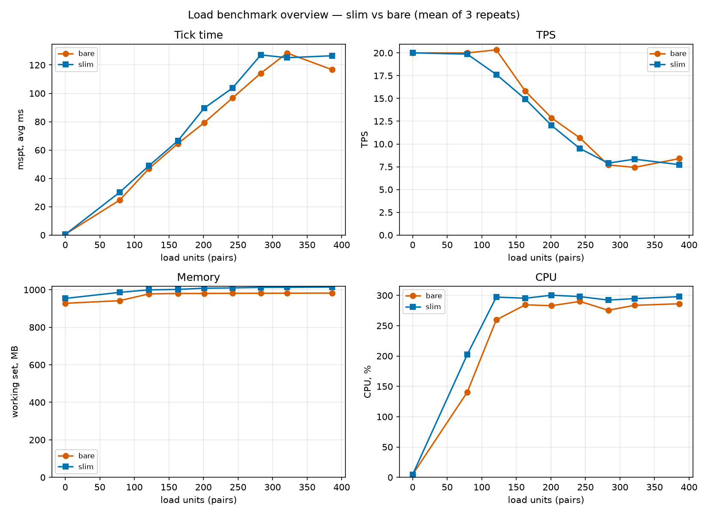

### Tick time (MSPT) vs load

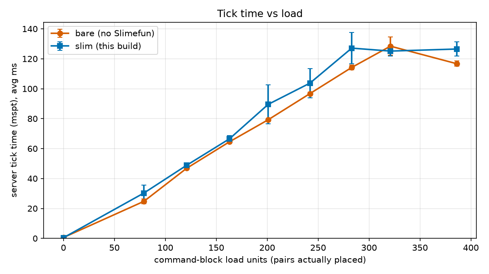
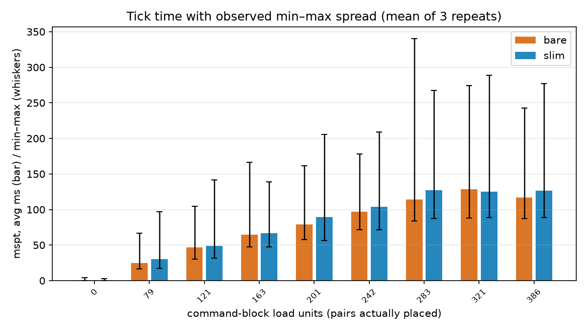
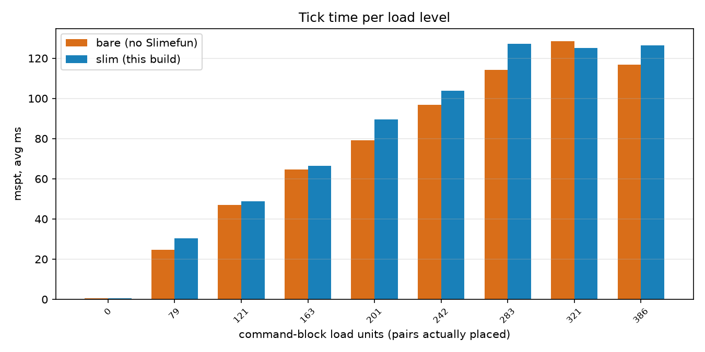

### TPS vs load

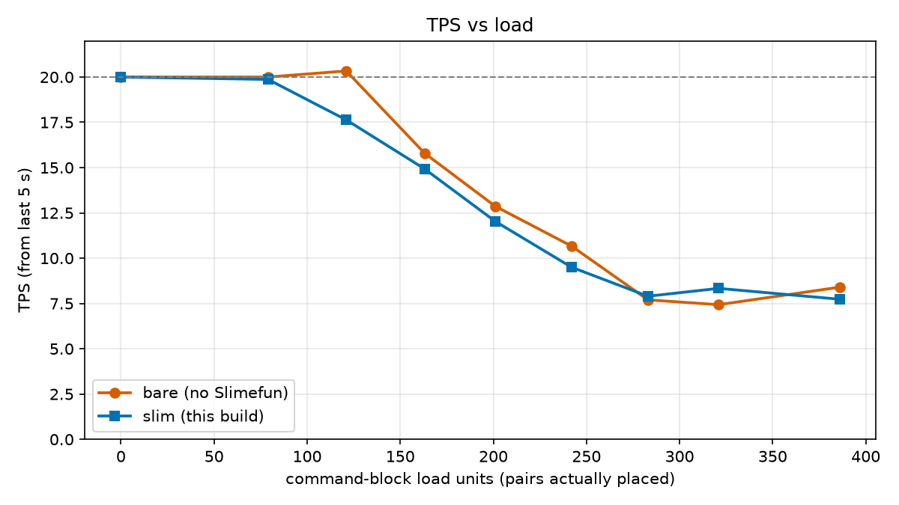
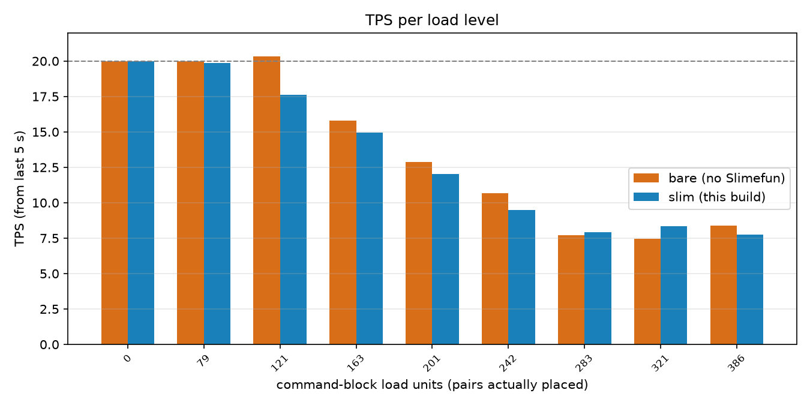

### Memory (working set) vs load

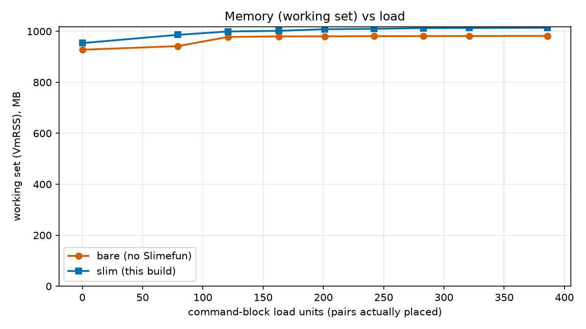

### CPU vs load

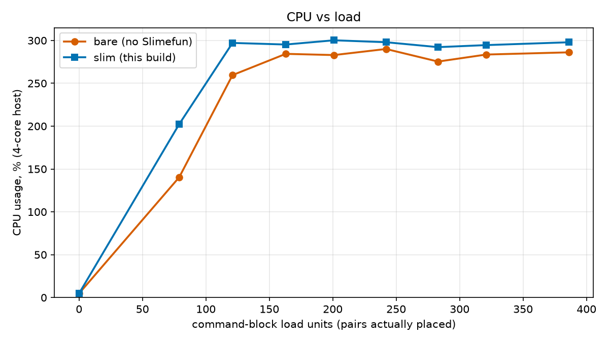

### Run-to-run variance (all 3 repeats)

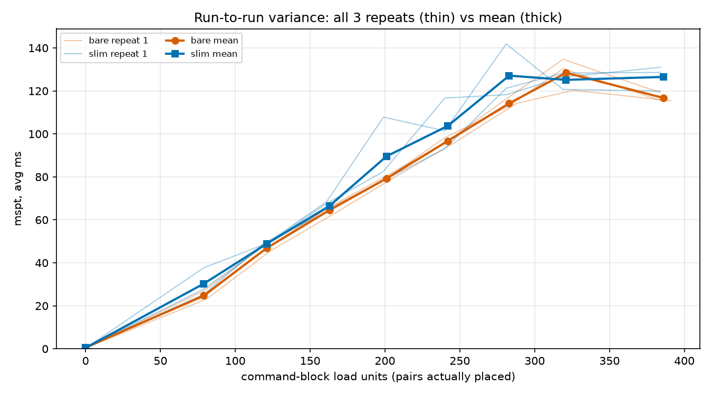

### Deltas (slim − bare)

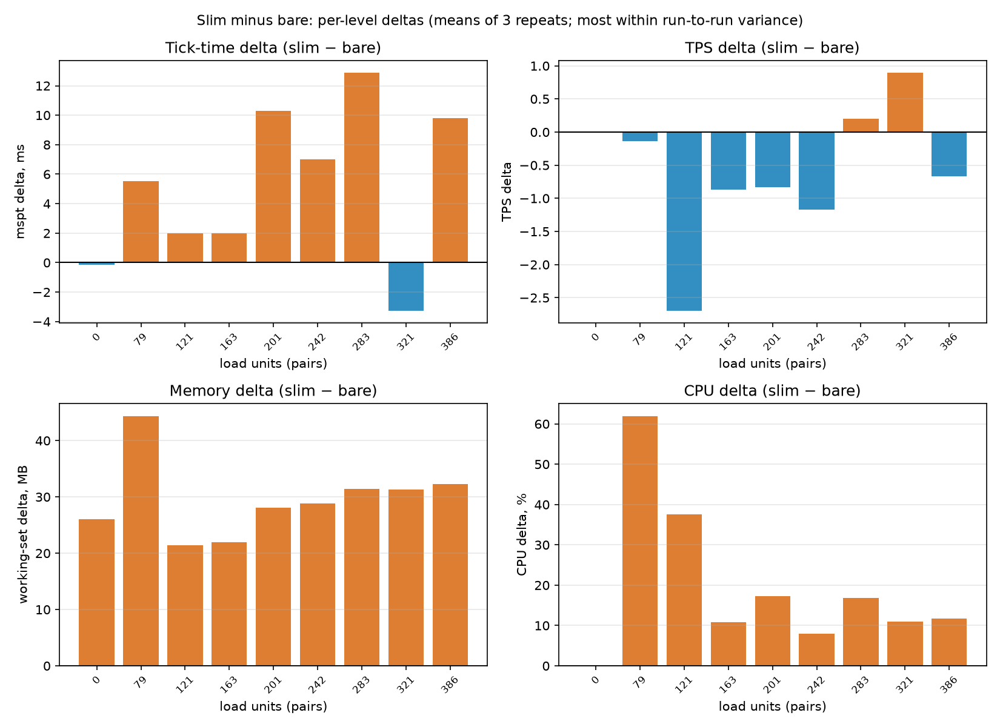

### Boot time & boot memory

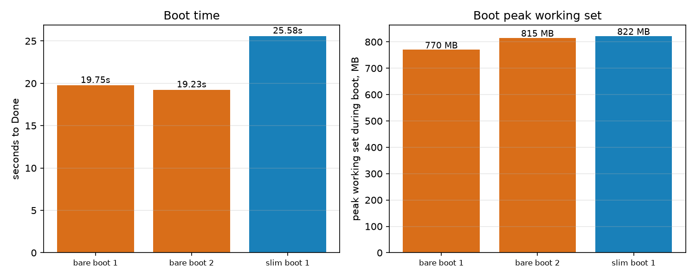

## Aggregate data (mean of 3 repeats)

### Tick time & TPS

| level | pairs | bare mspt | slim mspt | mspt diff | bare tps | slim tps | tps diff |
|---|---|---|---|---|---|---|---|
| 0 | 0 | 0.57 | 0.43 | −0.14 | 20.00 | 20.00 | 0.00 |
| 100 | 79 | 24.75 | 30.30 | +5.55 | 20.00 | 19.87 | −0.13 |
| 150 | 121 | 46.86 | 48.86 | +2.00 | 20.33 | 17.63 | −2.70 |
| 200 | 163 | 64.54 | 66.52 | +1.98 | 15.80 | 14.93 | −0.87 |
| 250 | 201 | 79.26 | 89.55 | +10.29 | 12.87 | 12.03 | −0.84 |
| 300 | 242 | 96.74 | 103.73 | +6.99 | 10.67 | 9.50 | −1.17 |
| 350 | 283 | 114.21 | 127.11 | +12.90 | 7.70 | 7.90 | +0.20 |
| 400 | 321 | 128.42 | 125.14 | −3.28 | 7.43 | 8.33 | +0.90 |
| 500 | 386 | 116.72 | 126.51 | +9.79 | 8.40 | 7.73 | −0.67 |

### Memory & CPU

| level | bare WS MB | slim WS MB | WS diff | bare CPU% | slim CPU% | CPU diff |
|---|---|---|---|---|---|---|
| 0 | 927.8 | 953.8 | +26.0 | 4.7 | 4.7 | 0.0 |
| 100 | 941.8 | 986.2 | +44.4 | 140.4 | 202.4 | +62.0 |
| 150 | 978.0 | 999.4 | +21.4 | 259.6 | 297.1 | +37.5 |
| 200 | 980.0 | 1001.9 | +21.9 | 284.4 | 295.3 | +10.9 |
| 250 | 980.3 | 1008.4 | +28.1 | 283.0 | 300.2 | +17.2 |
| 300 | 981.1 | 1009.9 | +28.8 | 290.0 | 297.9 | +7.9 |
| 350 | 981.3 | 1012.7 | +31.4 | 275.4 | 292.2 | +16.8 |
| 400 | 981.7 | 1013.0 | +31.3 | 283.6 | 294.6 | +11.0 |
| 500 | 982.1 | 1014.4 | +32.3 | 286.1 | 297.9 | +11.8 |

### Boot observations (from the harness `steps.log`)

| Run | Time to `Done` | Peak working set during boot |
|---|---|---|
| bare boot 1 | 19.752 s | 770.27 MB |
| bare boot 2 (intermediate restart) | 19.228 s | 815.24 MB |
| slim boot 1 | 25.581 s | 822.01 MB |

### Per-repeat detail (idle, mid, and max load)

| level | rep | bare mspt | bare tps | slim mspt | slim tps |
|---|---|---|---|---|---|
| 0 | 1 | 1.03 | 20.0 | 0.70 | 20.0 |
| 0 | 2 | 0.30 | 20.0 | 0.30 | 20.0 |
| 0 | 3 | 0.37 | 20.0 | 0.30 | 20.0 |
| 250 | 1 | 79.73 | 12.3 | 78.27 | 11.5 |
| 250 | 2 | 79.67 | 12.7 | 82.57 | 12.6 |
| 250 | 3 | 78.37 | 13.6 | 107.80 | 12.0 |
| 500 | 1 | 119.20 | 8.2 | 128.60 | 8.8 |
| 500 | 2 | 115.40 | 8.4 | 130.97 | 6.5 |
| 500 | 3 | 115.57 | 8.6 | 119.97 | 7.9 |

Full per-repeat data (all 9 levels × 3 repeats × 12 columns): `docs/benchmarks/data/fullslim.csv`, `docs/benchmarks/data/fullbare.csv`.

## Honest caveats

- The load is **synthetic CPU churn** (command-block fills). It measures how the tick engine responds to a
  fixed block-command workload, **not** real Slimefun usage (Cargo networks, machines, etc.). No real-world
  Slimefun activity was simulated.
- The `+2…+13 ms` deltas at mid/high load are **within the run-to-run variance** at most levels (see the
  error bars on the MSPT chart); the *mean* is consistently slightly higher for slim, which is why we report
  it, but we do not treat it as a strong effect.
- This is one container host. Absolute numbers will differ on other hardware; the **relative** story
  (no material tick degradation, +5.8 s boot, +52 MB boot peak) is what generalizes.
- The official Slimefun build cannot boot on 26.1.2, so there is no three-way comparison; the control is the
  bare server.
