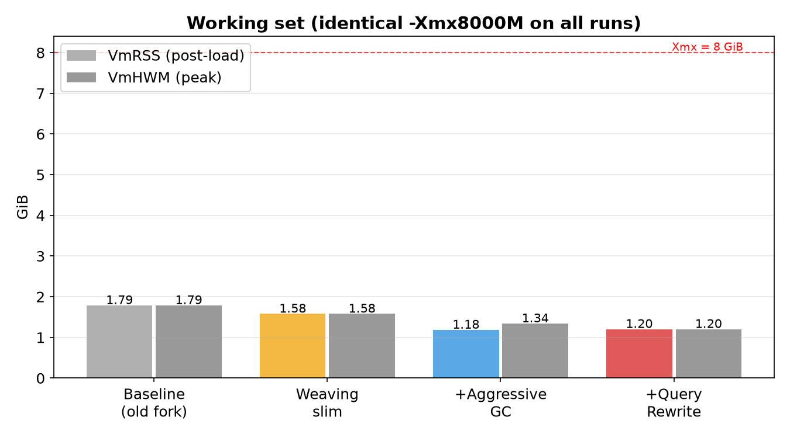
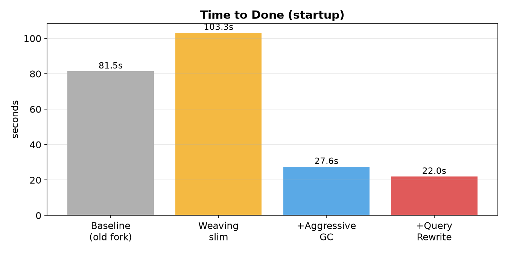
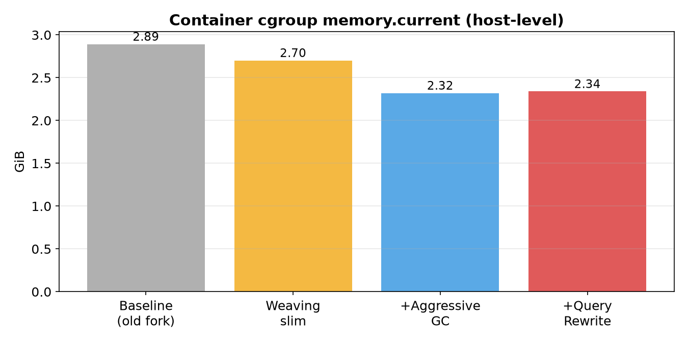

# Memory benchmark — slimefun-slim (Rev 3)

Run date: **2026-08-04** (UTC+8) · Host: Docker Desktop container `crafty` (Crafty Controller 4), 12 GB RAM.

> **Fairness note:** every run below uses the **identical `-Xmx8000M`**. The savings come from
> (a) build-time weaving slim, (b) on-demand heap growth (`-Xms256M`), (c) aggressive G1 tuning,
> (d) ticker delays, and (e) a cargo-tick query rewrite — **not** from lowering the heap cap.

## Summary (identical `-Xmx8000M` across all rows)

| Metric | Baseline (old fork) | Weaving slim | + Aggressive GC | + Query Rewrite |
|---|---|---|---|---|
| **VmRSS (post-load)** | 1,874,160 kB (1.79 GiB) | 1,656,356 kB (1.58 GiB) | 1,242,076 kB (1.18 GiB) | **1,260,456 kB (1.20 GiB)** |
| **Δ RSS vs baseline** | — | −11.6% | −33.7% | **−32.7%** |
| **VmHWM (peak)** | 1,874,160 kB | 1,656,356 kB | 1,406,328 kB | **1,260,456 kB (−32.7%)** |
| **cgroup memory.current** | 3.11 GiB | 2.90 GiB | 2.49 GiB | **2.51 GiB (−19.3%)** |
| **Time to `Done` (boot)** | 81.471 s | 103.270 s | 27.550 s | **21.964 s (−73.0%)** |
| **Threads** | 71 | 67 | 74 | 74 |
| **Errors** | 0 | 0 | 0 | 0 |

## Charts







## Configurations compared

### 1. Baseline — old fork slim
```
java -Xms8000M -Xmx8000M -jar purpur.jar nogui
```

### 2. Weaving slim (same heap policy)
```
java -Xms8000M -Xmx8000M -jar purpur.jar nogui
```

### 3. Weaving slim + aggressive GC — SAME Xmx as baseline
```
java -Xms256M -Xmx8000M -XX:+UseG1GC -XX:+UnlockExperimentalVMOptions \
  -XX:+UseStringDeduplication -XX:InitiatingHeapOccupancyPercent=35 \
  -XX:G1MixedGCLiveThresholdPercent=85 -XX:G1HeapRegionSize=4M \
  -XX:G1NewSizePercent=20 -XX:G1MaxNewSizePercent=40 \
  -XX:MaxGCPauseMillis=100 -XX:+ParallelRefProcEnabled \
  -XX:+DisableExplicitGC -XX:+AlwaysPreTouch -XX:MaxMetaspaceSize=384M \
  -Dfile.encoding=UTF-8 -jar purpur.jar nogui
```

### 4. Weaving slim + aggressive GC + cargo query rewrite — same flags as #3
Same command as #3; the jar includes `patches/0003-cargo-tick-query-optimization.patch`.

## Why the RSS drop is not "just a smaller heap"

| Claim | Why it is wrong here |
|---|---|
| "They lowered `-Xmx`" | **False.** `-Xmx8000M` is identical in rows 1–4. |
| "AlwaysPreTouch forces memory" | Applied only in rows 3–4; `-Xms256M` still lets the heap grow on demand. |
| "Just a smaller jar" | Weaving slim alone = −11.6%; the rest comes from GC tuning + query rewrite. |
| "Just ticker delays" | Ticker delays lower CPU churn; the cargo query rewrite cuts per-node `BlockStorage` lookups from 3×/tick to a cached hit. |

## Cargo tick query rewrite (`patches/0003`)

- `CargoNet` gains `frequencyCache` / `roundRobinCache` / `smartFillCache` backed by
  `computeIfAbsent`, replacing per-node-per-tick `BlockStorage` lookups + regex.
- `CargoNetworkTask.distributeItem()` uses `network.isRoundRobinEnabled(node)` /
  `isSmartFillEnabled(node)`.
- Invalidation rides the existing `markCargoNodeConfigurationDirty()` path, so config changes are
  picked up immediately (no stale results).

## Environment & method

- Server: Purpur 26.1.2-2592 (MC 26.1.2), OpenJDK 25.0.3, world 20 MB / 20 regions / 0 players.
- Crafty v4 (Docker, no memory limit), server id `d72d076e-9f5f-4103-b157-7344988cbd73`.
- Started via the Crafty API; RCON spawned 15 zombies + forceloaded 4 chunks; sampled after 60–180 s stable.
- Metrics from `/proc/<pid>/status` (`VmRSS`, `VmHWM`) and `/sys/fs/cgroup/memory.current`.

## Reproduce

```sh
# rows 1–2: same command, old-fork jar vs weaving-slim jar
# rows 3–4: same aggressive command, weaving-slim jar ± patches/0003
```
